# Tamagochis

Juego de tableros, multijugador que implementa movimiento y rotación.

## Explicacicón del código
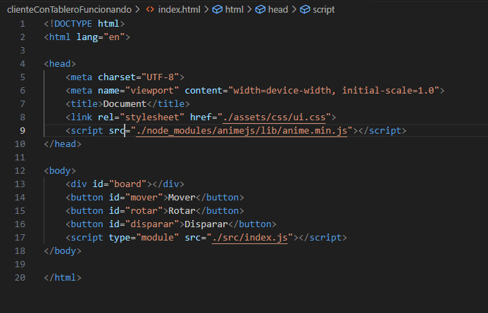
 Botones en el cliente
### Rotación 

He conseguido implementar la rotación, gestionada por el servidor e interpretada por el cliente de una forma, que yo considero buena: 

- Se registra el evento en el cliente y se manda al servidor.
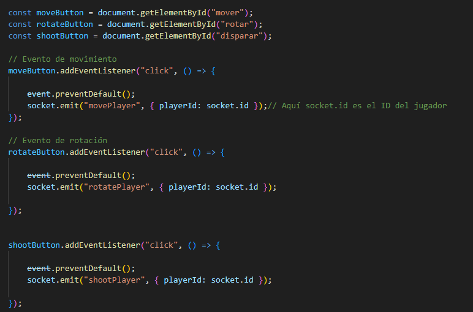
- El servidor lo recoge y llama a un método que se encarga de cambiar la propiedad direccion del jugador, cuando esta se cambia se manda el jugador al cliente.
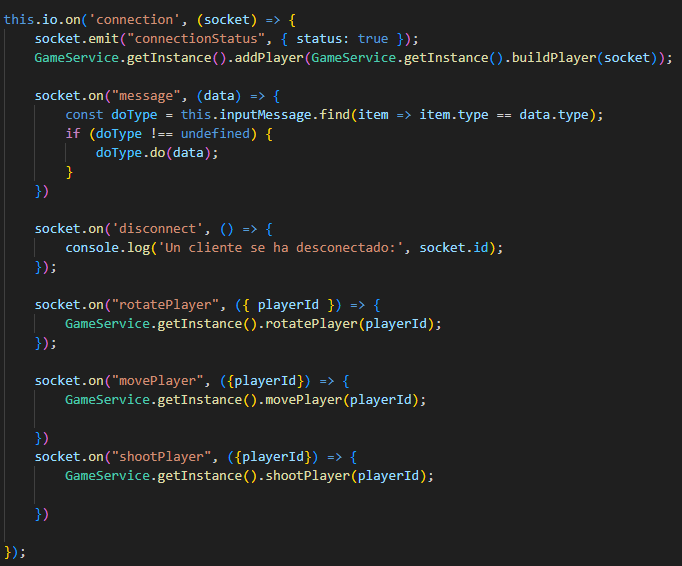
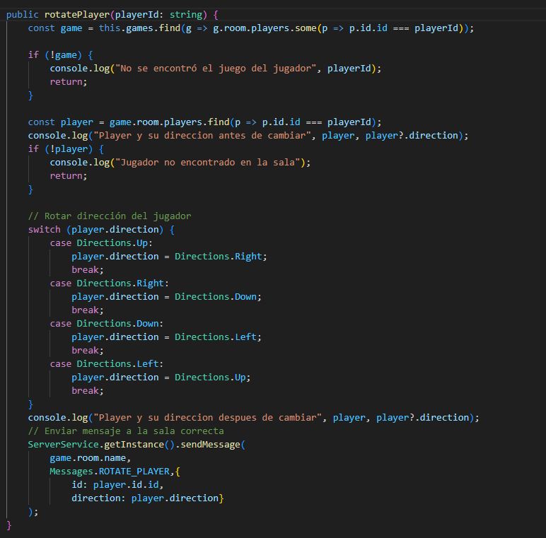
- En el cliente se recoge el mensaje del servidor y para pintar el jugador con la rotación adecuada se vuelve a pintar el tablero.
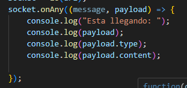

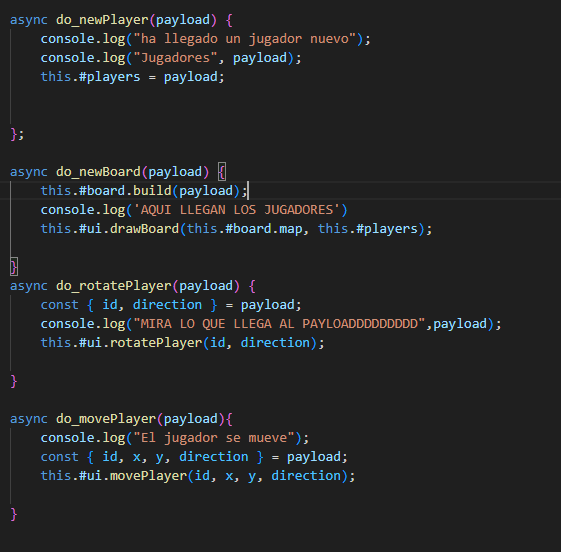

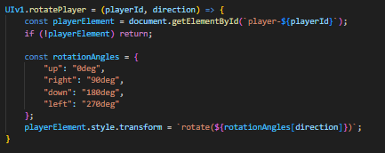

### Movimiento 

He conseguido implementar el movimiento, de una manera similar a la rotación en cuanto a la comunicación cliente-servidor :  

- Se registra el evento en el cliente y se manda al servidor.

- El servidor lo recoge y llama a un método que se encarga, primero de aumentar o disminuir la x e y del jugador en función de su dirección y antes de volver a asinagserla al jugador, comprueba la colisión entre jugadores y límites de tablero.

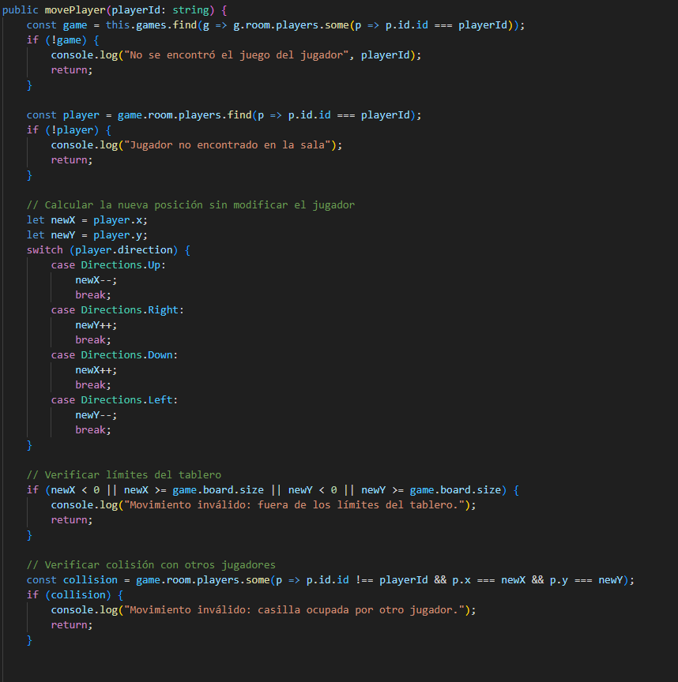
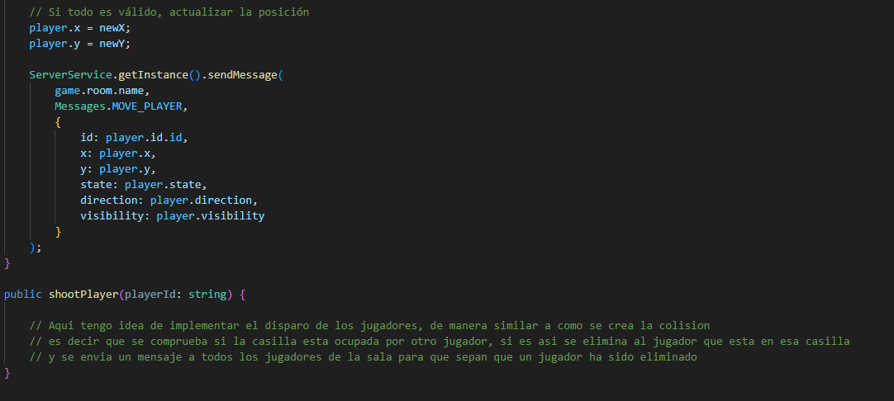
- En el cliente se recoge el mensaje del servidor y para pintar el jugador con las nuevas coordenadas se vuelve a pintar el tablero.

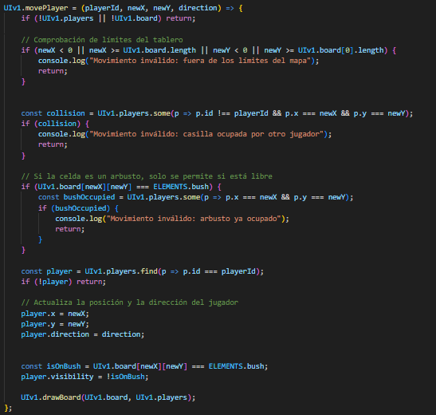

### Disparar a otros jugadores

No lo he podido implementar pero tengo la idea de implementarlo de manera similar a como se gestionan las colisiones, con otros jugadores, es decir que se comprueba si la casilla esta vacía o no, si lo está no pasa nada pero si lo está, se busca el id del jugador que está en esa casilla y se mata ese jugador. No sé si el planteamiento estará correcto, pero creo que así sería una forma rápida de hacerlo.

### Otras cosas a mejorar / implementar

He usado el mismo método para mandar los mensajes que hemos hecho en clase

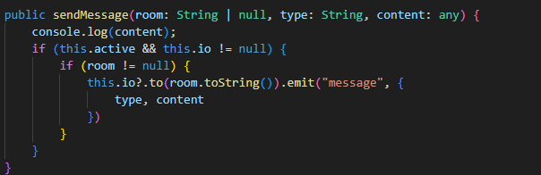

Y usado el método drawboard para pintar de nuevo a los jugadores 
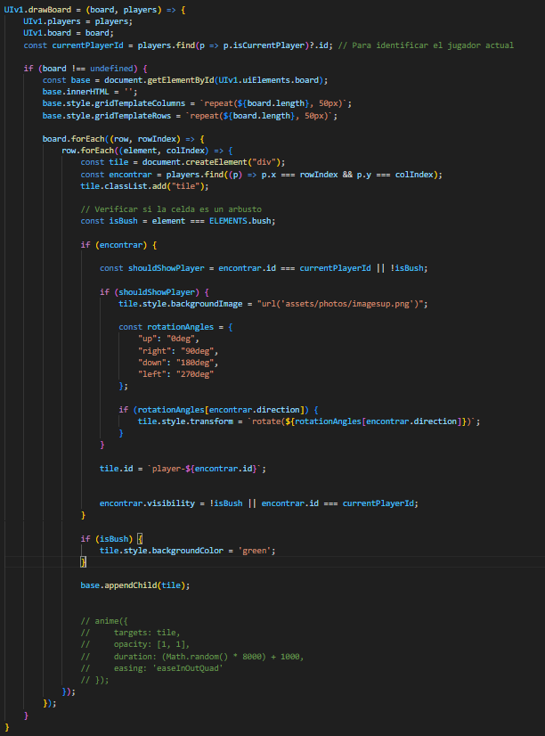

Posterior a esto, tendría que hacer que a los usuarios se les asignen las posiciones inciales de una manera más eficiente, porque ahora mismo solo funciona en el primer juego, así como generar el tablero de otra forma y generar los arbustos de manera aleatoria pero que se ajusten a lo que se pedía, que no se generen uno a lado del otro y demás. Quedan por implementar cosas, pero lo que está hecho lo he hecho yo y lo entiendo.

## Rúbrica

1. Diseño del Tablero y Mecánicas de Juego (20 puntos)

• (5 pts) Implementación de un tablero de tamaño NxN correctamente generado.✔️

• (5 pts) Configuración inicial de los jugadores en las esquinas del tablero.✔️

• (5 pts) Implementación de ataques entre jugadores con reglas de distancia.

• (5 pts) Implementación de casillas de escondite con normas de posicionamiento

adecuadas.

2. Comunicación Cliente-Servidor con WebSockets (20 puntos)
• (5 pts) Configuración del servidor para manejar conexiones de clientes vía WebSockets.✔️

• (5 pts) Envío y recepción de mensajes de manera eficiente entre cliente y servidor.✔️

• (5 pts) Sincronización en tiempo real del estado del juego en todos los clientes
conectados.✔️

• (5 pts) Manejo de desconexiones y reconexiones de jugadores sin afectar la partida.

3. Implementación del Cliente y Eventos del Juego (20 puntos)

• (5 pts) Representación visual dinámica del tablero y los jugadores según datos del servidor.✔️

• (5 pts) Implementación de eventos de juego: desplazamiento, rotación y disparo.✔️(falta disparo)

• (5 pts) Diseño de una interfaz intuitiva para la interacción del jugador.✔️

• (5 pts) Adaptabilidad del cliente a posibles rediseños o mejoras futuras.✔️

4. Gestión de Salas y Control de Juego (20 puntos)

• (5 pts) Implementación de salas para gestionar partidas independientes.✔️

• (5 pts) Control centralizado del estado del juego en el servidor.✔️

• (5 pts) Compartición eficiente de datos del mapa entre todos los clientes.✔️

• (5 pts) Manejo de finalización de partidas y asignación de ganadores.

5. Uso de Buenas Prácticas de Programación y Patrones de Diseño (10 puntos)

• (5 pts) Uso adecuado de clases, objetos JSON y patrones de diseño.✔️

• (5 pts) Código modular y bien estructurado que facilite la escalabilidad. 

6. Nivel Avanzado: Adaptación a Angular (10 puntos)

• (5 pts) Refactorización del cliente para adaptarlo a Angular.

• (5 pts) Implementación de servicios y componentes en Angular para la gestión del juego.

